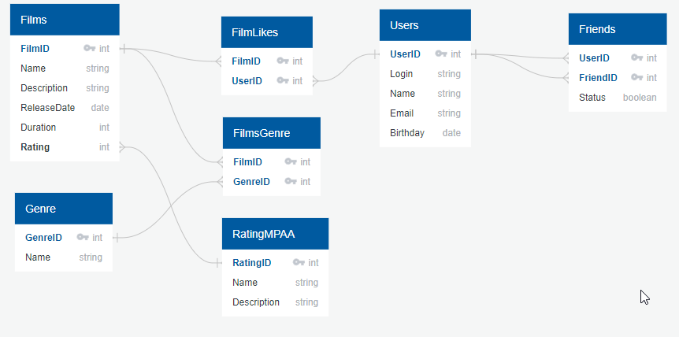

# java-filmorate


## Примеры запросов.
Получение фильма по ID
```sql
SELECT films.FilmID,
        films.Name,
        films.Description,
        films.ReleaseDate,
        films.Duration,
        RatingMPAA.Name AS Rating
FROM films
LEFT JOIN RatingMPAA ON films.FilmID = RatingMPAA.RatingID
WHERE films.FilmID = '1'
```
Получение пользователя по ID
```sql
SELECT UserID,
       Login,
       Name,
       Email,
       Birthday
FROM Users
WHERE UserID = '1';
```
Получение топ фильмов
```sql
SELECT films.FilmID,
       films.Name,
       films.Description,
       films.ReleaseDate,
       films.Duration,
       RatingMPAA.Name AS Rating
FROM films
LEFT JOIN RatingMPAA ON films.FilmID = RatingMPAA.RatingID;
WHERE films.FilmID IN
    (SELECT filmID
     FROM FilmLikes
     GROUP BY filmID
     ORDER BY COUNT(userID) DESC
     LIMIT 10)
```
Получение друзей пользователя
```sql
SELECT Users.UserID,
       Users.Login,
       Users.Name,
       Users.Email,
       Users.Birthday
FROM Users
INNER JOIN Friends ON Users.UserID = Friends.FriendID
WHERE Friends.UserID = '1';
```
Получение общих друзей
```sql
SELECT UserID,
       Login,
       Name,
       Email,
       Birthday
FROM Users
WHERE UserID IN
    (SELECT FriendID
     FROM Friends
     WHERE UserID = '1'
       AND FriendID <> '2'
     UNION SELECT FriendID
     FROM Friends
     WHERE UserID = '2'
       AND FriendID <> '1');
```
